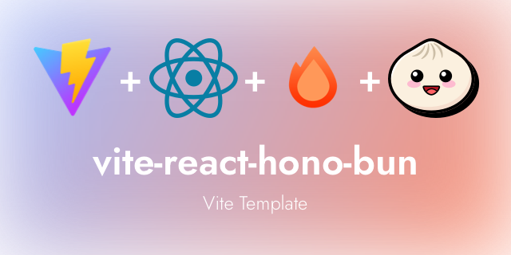

# Vite Template with Bun, React, and Hono

A modern template for web applications using Bun as the runtime. Designed for fast development and clean architecture, it leverages Vite for bundling, React Router for client-side routing, and Hono for API routes.

## 🚀 Features

- **Bun Runtime**: Maximum performance with Bun.
- **React Single Page Application**: React pages from `./src/views` are bundled into a SPA.
- **Routing with [react-router-dom](https://reactrouter.com/en/main/start/overview)**: Efficient and straightforward client-side routing.
- **API Routes with [Hono](https://hono.dev)**: Define and manage APIs in `./src/api`.
- **[RPC Client](https://hono.dev/docs/guides/rpc)**: Includes an RPC client for API routes in `./src/tools/api.ts`.
- **Docker Support**: Includes a Dockerfile for easy containerization.

## 📂 Project Structure

```plaintext  
├── src  
│   ├── views/        # React components for the SPA  
│   ├── api/          # API routes with Hono  
│   ├── tools  
│   │   └── api.ts    # RPC client for API routes  
│   ├── server.tsx    # Hono server setup  
│   ├── client.tsx    # React Router setup  
├── public/           # Static files (images, CSS, etc.)  
├── Dockerfile        # Docker configuration file
└── vite.config.js    # Vite configuration
```  

## 🛠️ Installation

### Prerequisites
- **Bun**: Install Bun via [bun.sh](https://bun.sh).
- **Docker** (optional): For containerization.

### Create a New Project

1. **Initialize the project**:
   ```bash  
   bun create github.com/0x2321/vite-react-hono-bun <project-name>  
   cd <project-name>  
   ```  

2. **Start the development server**:
   ```bash  
   bun run dev  
   ```  

3. **Build the project**:
   ```bash  
   bun run build  
   ```  

## 🐳 Docker

The project includes a Dockerfile for easy containerization.

### Build the Docker image

```bash  
docker build -t vite-hono-react-bun .
```  

### Run the container

```bash  
docker run -p 3000:3000 vite-hono-react-bun
```  

The application will be accessible at `http://localhost:3000`.

## 🧭 Routing

The SPA uses `react-router-dom` for client-side routing. Pages are located in the `./src/views` directory.

Example from `client.tsx`:

```tsx  
import * as React from "react";
import * as ReactDOM from "react-dom/client";
import { Route, BrowserRouter, Routes } from "react-router-dom";
import { Home, NotFound } from "@/views";

ReactDOM.createRoot(document.getElementById("root")!).render(
  <React.StrictMode>
    <BrowserRouter>
      <Routes>
        <Route path="*" element={<NotFound />} />
        <Route path="/" element={<Home />} />
        <Route path="/dashboard" element={<div>Hello dashboard!</div>} />
      </Routes>
    </BrowserRouter>
  </React.StrictMode>
);
```  

## 🌐 API Routes

API routes are defined with **Hono** in `./src/api` and served through `server.tsx`.

Example `./src/api/pong.ts`:

```tsx  
import {Hono} from "hono";

const pingRoutes = new Hono()
        .get('/', c => c.text('Pong!')); // use chaining, otherwise there will be type errors

export {pingRoutes};
```  

Example `./src/api/index.ts`:

```tsx  
import { Hono } from "hono";
import {pingRoutes} from "@/api/pong.ts";

const apiRoutes = new Hono()
        .route('/ping', pingRoutes);    // uuse chaining, otherwise there will be type errors

export { apiRoutes };
export type ApiRouteType = typeof apiRoutes; // important to use the build-in api client!
```  

## 🔗 RPC Client

An RPC client for API routes is provided in `./src/tools/api.ts`. Example usage:

```typescript  
import { api } from '@/tools/api';

api.ping.$get().then(async resp => {
  if (resp.ok) {
    const text = await resp.text();
    console.log(text);
  }
});
```  

## 📄 License

This project is licensed under the **MIT License**. See the [LICENSE](./LICENSE) file for details.
